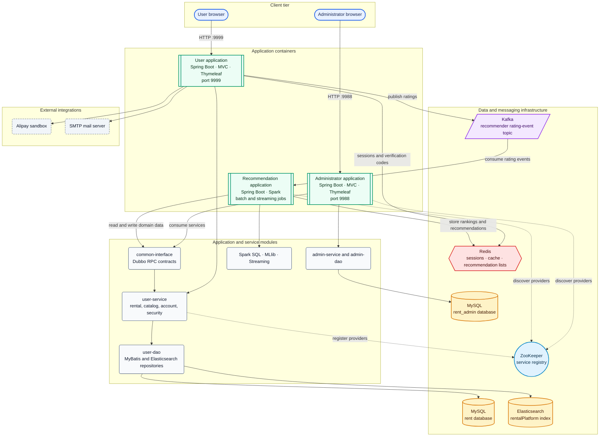
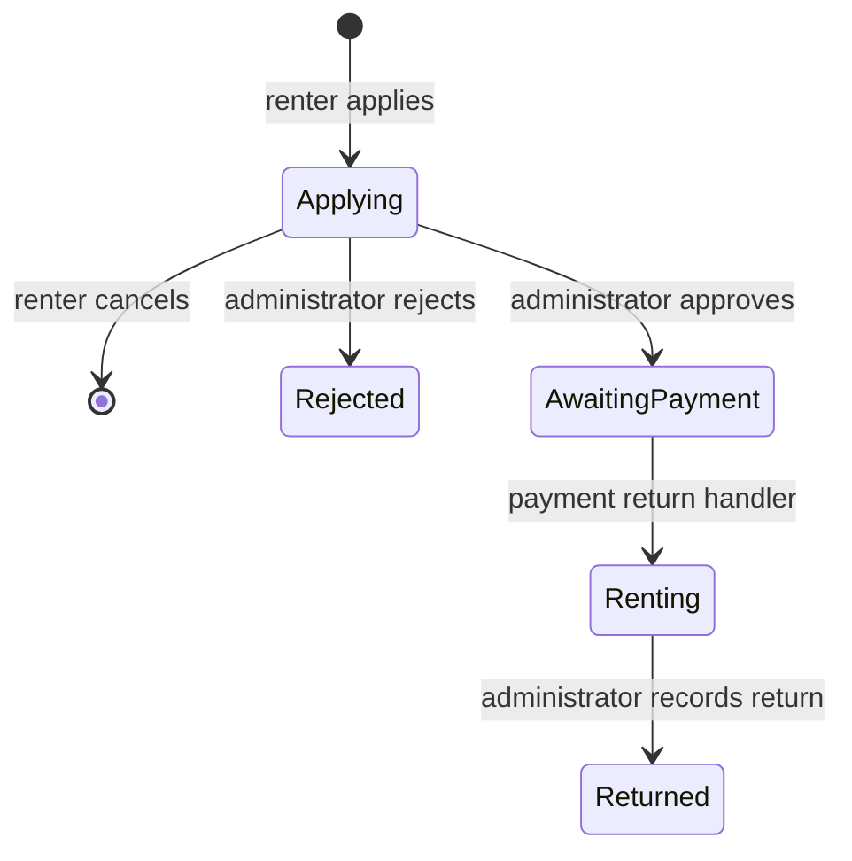
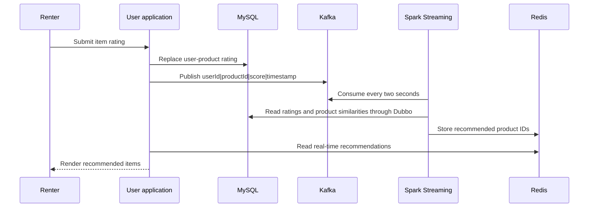
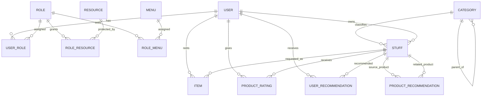

# rent-X Campus Rental Platform

rent-X is a multi-module Java rental marketplace for a campus community. Owners can list items, renters can apply for and pay for rentals, administrators can approve rental requests and review daily statistics, and the platform can recommend items from historical and real-time ratings.

The project combines a server-rendered Spring Boot application with a separate administrator application and a Spark-based recommendation process. MySQL stores business records, Redis stores sessions and recommendation lists, Elasticsearch supports item search, Kafka carries rating events, and Dubbo with ZooKeeper connects the applications to shared services.

> This documentation describes the behavior present in the source code. The repository does not contain database DDL, seed data, container definitions, or a complete automated test suite, so it is not a turnkey deployment.

## Main Functions

### Accounts and access control

- Register as a lessor or lessee with an email verification code.
- Log in with a username, password, and image CAPTCHA.
- Store passwords with BCrypt.
- Authorize requests through database-defined roles and resources.
- Use the built-in roles `ROOT`, `LESSOR`, `LESSEE`, and `GUEST`.
- Store web sessions and short-lived verification codes in Redis.

### Item listing and discovery

- Publish an item with a category, description, deposit, daily rental price, and availability status.
- Organize items in a three-level category tree.
- Browse available items and view the owner, price, average rating, state, and expected return date.
- Search by category, name, and description through Elasticsearch.
- Stop offering an item when it is not involved in an active rental.

### Rental workflow

- Apply to rent an item for a specified number of days.
- Cancel a pending application.
- Let an administrator approve or reject the application.
- Pay the deposit and total rental charge through the Alipay sandbox integration.
- Mark a rented item as returned.
- Rate a rented product and publish the rating event to Kafka.

The payment total is calculated as:

```text
total = deposit + (daily rental price x rental days)
```

### Recommendations

- Personalized recommendations generated by Spark MLlib ALS.
- Similar-item recommendations based on latent product vectors.
- An alternative item-based collaborative filtering implementation.
- Historical popularity and average-score rankings.
- Real-time recommendations updated from Kafka rating events and recent Redis history.

### Administration and communication

- Manage the category hierarchy.
- Review all rental applications and change their state.
- Filter daily rental statistics by date, category, and state.
- Report rental counts, deposits, and rental totals.
- Use a WebSocket broadcast chat with online-user counts.

## Technology Stack

| Area | Technology |
| --- | --- |
| Language and build | Java 8, Maven multi-module build |
| Web | Spring Boot 2.1.1, Spring MVC, Thymeleaf |
| Security | Spring Security, BCrypt, Kaptcha, role-resource rules |
| Persistence | MySQL, MyBatis-Plus 3.0.6, MyBatis XML mappers, Druid |
| Search | Spring Data Elasticsearch |
| Cache and sessions | Redis |
| RPC | Dubbo 2.6.5 with ZooKeeper |
| Messaging | Kafka client 0.10.2.1 and Spring Kafka |
| Recommendation | Apache Spark 2.1.1, Spark SQL, MLlib, Spark Streaming, Scala 2.11.8, JBLAS |
| Real-time UI | Java WebSocket API |
| Validation and mapping | Bean Validation, Fluent Validator, Easy Mapper |
| Payment and mail | Alipay sandbox SDK, Spring Mail |

## Architecture



Shape key: stadium = browser, double-bordered rectangle = application container, rounded rectangle = internal module or integration, cylinder = persistent data store, hexagon = Redis cache, parallelogram = Kafka event stream, and circle = ZooKeeper registry.

### Module responsibilities

| Module | Responsibility |
| --- | --- |
| `common` | Shared response models, base entities, enums, validation support, security aspects, CAPTCHA configuration, and utility classes. |
| `common-interface` | Dubbo service contracts plus RPC DTO and parameter types shared by providers and consumers. |
| `user-dao` | User-side entities, MyBatis-Plus mappers, custom MyBatis queries, and the Elasticsearch repository. |
| `user-service` | Rental, item, category, account, authorization, rating, recommendation, and mail business logic. It also exposes Dubbo providers. |
| `user-business` | Main web application, Thymeleaf pages, controllers, Spring Security, registration, payment, Kafka rating publication, and WebSocket chat. |
| `admin-dao` | Administrator account persistence. |
| `admin-service` | Administrator-side user service. |
| `admin-business` | Administrator web application and Dubbo consumers for category and rental management. |
| `recommender` | Data loading, statistics, ALS, item-based collaborative filtering, and Spark Streaming recommendations. |

### Layer and service boundaries

The main user application packages the controller, service, and DAO modules into one Spring Boot process. The same service layer exposes selected operations as Dubbo providers on port `20880`. The administrator and recommendation applications consume those RPC contracts through ZooKeeper.

```text
Web controller -> service -> mapper/repository -> MySQL or Elasticsearch
Admin/recommender -> common-interface -> Dubbo -> user-service -> user-dao
```

## Core Workflows

### Rental lifecycle

The `item` record represents one rental request. The related `stuff` record represents the rentable product.

| Rental state | Code | Meaning | Product state after transition |
| --- | ---: | --- | --- |
| Applying | `0` | The renter submitted a request. | Application pending (`1`) |
| Rejected | `1` | An administrator rejected the request. | Available (`0`) |
| Awaiting payment | `2` | An administrator approved the request. | Rented (`2`) in the current implementation |
| Renting | `3` | Payment completed and the rental is active. | Rented (`2`) |
| Returned | `4` | The renter returned the item. | Available (`0`) |

Product availability uses these values:

| Product state | Code | English meaning |
| --- | ---: | --- |
| Available | `0` | The product can be rented. |
| Application pending | `1` | A rental application exists. |
| Rented | `2` | The product is assigned to a rental. |
| Not offered | `3` | The owner has disabled the listing. |

The implemented sequence is:



### Registration and login

1. The client requests an image CAPTCHA. The server stores its answer in Redis for five minutes under a UUID-based key.
2. Registration sends a six-character email code and stores it in Redis for two minutes using a session-and-email key.
3. The server validates the email code, username, email, password confirmation, and selected role.
4. The service stores a BCrypt password, creates the user-role relationship, and adds the account to the in-memory Spring Security user store.
5. Login checks the CAPTCHA before Spring Security processes the username and password.

### Search

`StuffDocument` maps products to the Elasticsearch index `rentalPlatform` with document type `stuff`. The search service queries the derived repository method `findByNameAndDescriptionAndCategoryId` and enriches results with category names from MySQL.

### Rating event flow



## Recommendation Algorithms

### 1. Offline ALS recommendations

`OfflineRecommender` loads all ratings through Dubbo and trains Spark MLlib's explicit-feedback alternating least squares model.

Current parameters:

| Parameter | Value |
| --- | ---: |
| Latent rank | `5` |
| Iterations | `10` |
| Regularization | `0.01` |
| Maximum recommendations per user | `20` |

ALS approximates the sparse user-product rating matrix with two low-rank matrices:

```text
R approximately equals U x P transpose
```

The job predicts the Cartesian product of known users and products, removes non-positive predictions, sorts each user's results by predicted score, and stores the highest-scoring 20 products in `user_recommendation`.

The trained product feature vectors also produce related-product recommendations. For two product vectors `a` and `b`, the implementation uses cosine similarity:

```text
similarity(a, b) = dot(a, b) / (norm(a) x norm(b))
```

Pairs with similarity greater than `0.4` are written to `product_recommendation`.

### 2. ALS parameter evaluation

`ALSTrainer` randomly divides ratings into 80% training data and 20% test data. It evaluates these combinations:

- Rank: `1`, `3`, `5`, `8`, `10`
- Regularization: `3`, `1`, `0.3`, `0.1`, `0.03`, `0.01`
- Iterations: `10`

It joins actual and predicted ratings by user and product, then reports root mean squared error:

```text
RMSE = sqrt(mean((actual rating - predicted rating)^2))
```

### 3. Item-based collaborative filtering

`ItemCFRecommender` counts how often users rate each product and each product pair. Its intended co-occurrence similarity is:

```text
similarity(i, j) = users who rated both i and j / sqrt(raters(i) x raters(j))
```

The intended output is the ten most similar products for each product. See the implementation notes below for two issues in the current code path.

### 4. Popularity and quality statistics

`StatisticsRecommender` uses Spark SQL to derive:

- Historical popularity, ordered by rating count.
- Recent popularity, grouped by product and rating month.
- Product quality, ordered by average rating.

Historical popularity is stored in the Redis list `historicalHot`, and the average-rating order is stored in `highRating`. The recent-popularity persistence step is still marked as a TODO.

### 5. Real-time recommendations

`OnlineRecommender` consumes the Kafka topic `recommender` in two-second Spark Streaming batches.

For each rating event it:

1. Loads up to 20 recent ratings from Redis key `user:{userId}`.
2. Chooses up to 20 products similar to the newly rated product.
3. Removes products the user has already rated.
4. Keeps similarity contributions above `0.4`.
5. Combines similarity-weighted recent ratings with positive and negative feedback counts.

For candidate product `p`, the score is:

```text
score(p) = mean(similarity(p, rated product) x rating)
         + log10(number of ratings above 3)
         - log10(number of ratings at or below 3)
```

The resulting product IDs are pushed to Redis for display by the user application.

## Database Design

No SQL schema is included. The following logical design is inferred from the entities and mapper queries. Most business tables inherit these audit fields from `BaseEntity`:

| Field | Purpose |
| --- | --- |
| `id` | Integer identifier. |
| `add_user_id` | User that created the record. |
| `add_time` | Creation time. |
| `update_user_id` | User that last changed the record. |
| `update_time` | Last update time. |
| `mark` | Logical validity/deletion flag. The queries treat `1` as active. |

### Main relational tables

| Table | Important fields | Purpose |
| --- | --- | --- |
| `user` | `username`, `password`, `email`, `sex`, `status` | Account and login profile. Sex values are female `0`, male `1`, and undisclosed `2`. |
| `role` | `identifier`, `name`, `description` | Role definitions. |
| `user_role` | `user_id`, `role_id` | Many-to-many account-to-role relation. |
| `resource` | `name`, `description`, `url`, `method` | Protected HTTP resources. |
| `role_resource` | `role_id`, `resource_id` | Role authorization rules loaded by Spring Security. |
| `menu` | `pid`, `name`, `url` | Hierarchical navigation entries. A root menu has `pid = 0`. |
| `role_menu` | `role_id`, `menu_id` | Role-specific navigation. |
| `category` | `name`, `description`, `parent_id`, `level`, `status` | Three-level item taxonomy. A root category has `parent_id = 0`. |
| `stuff` | `category_id`, `name`, `description`, `deposit`, `rental`, `status`, `picture_id`, `user_id` | Rentable product owned by a user. |
| `item` | `user_id`, `stuff_id`, `apply_time`, `approval_time`, `pay_time`, `rent_day`, `end_time`, `status`, `add_date` | Rental request and transaction lifecycle. |
| `product_rating` | `user_id`, `product_id`, `score`, `rating_time` | User rating. The source models `user_id` and `product_id` as a composite key. |
| `user_recommendation` | `user_id`, `product_id`, `score` | Offline personalized recommendation result. |
| `product_recommendation` | `parent_product_id`, `product_id`, `score` | Similar-product recommendation result. |

The administrator application also uses a separate `rent_admin` database with an administrator `user` entity containing a username, BCrypt password, and inherited audit fields.

### Entity relationships



### Other data stores

| Store | Data |
| --- | --- |
| Redis | Spring sessions, image CAPTCHAs, email verification codes, recent user ratings, historical popularity, high-rating rankings, and streaming recommendations. |
| Elasticsearch | Searchable copies of `stuff` records in index `rentalPlatform`. |
| Kafka | Rating events on topic `recommender`. |
| ZooKeeper | Dubbo service registration and discovery. |

## HTTP Interface Summary

This is a server-rendered application, not a versioned public REST API. Several endpoints return JSON or a shared `Response` wrapper for page scripts.

| Area | Representative endpoints |
| --- | --- |
| Authentication | `GET /login`, `GET /captcha`, `GET /forget` |
| Registration | `GET /register`, `POST /users`, `POST /emails/{email}/send-captcha` |
| Listings | `GET /stuffs/in`, `POST /stuffs/out`, `GET /stuffs/out`, `POST /stuffs/{id}/cancel-rent` |
| Rentals | `POST /stuffs/{id}/rent`, `GET /items/in`, `POST /items/{id}/cancel-apply` |
| Payment | `POST /items/{id}/pay`, `GET /items/pay/return` |
| Search | `GET /stuffs/search`, `POST /stuffs/search` |
| Ratings | `POST /rating/{itemId}`, `GET /rating?itemId={id}` |
| Recommendations | `GET /recommend/user`, `GET /recommend/product`, `GET /recommend/hot`, `GET /recommend/streaming` |
| Chat | `GET /chat/index`, WebSocket `/chatServer` |
| Administration | `/categories/**`, `/items/**`, `/users`, `/chat/**` on port `9988` |

## Project Layout

```text
rental-platform/
|-- pom.xml
|-- common/
|-- common-interface/
|-- user-dao/
|-- user-service/
|-- user-business/
|-- admin-dao/
|-- admin-service/
|-- admin-business/
`-- recommender/
```

## Local Setup

### Prerequisites

- JDK 8
- Maven 3.6 or later
- MySQL with databases named `rent` and `rent_admin`
- Redis
- Elasticsearch compatible with the Spring Boot 2.1.1 dependency set
- ZooKeeper and a Dubbo-compatible registry setup
- Kafka with a topic named `recommender`
- Mail credentials if email registration is required
- Alipay sandbox credentials if payment is required

Spark runs with `local[*]` in the checked-in recommender configuration, so a separate Spark cluster is not required for local execution.

### Configuration

Review these files before starting any application:

- `user-business/src/main/resources/application.yml`
- `admin-business/src/main/resources/application.yml`
- `recommender/src/main/resources/application.yml`

Configure the following values for your environment:

- MySQL URLs and credentials
- Redis URL
- Elasticsearch cluster name and nodes
- Kafka bootstrap servers
- ZooKeeper address
- Mail server and sender credentials
- Alipay application ID, keys, gateway, and return URL

Do not reuse the values currently committed in the YAML files. They include live-looking credentials, private key material, and public network endpoints. Rotate or revoke those credentials, remove them from version history, and load replacements from environment variables or an external secret store.

The repository does not include SQL migrations or seed data. Create the tables described in [Database Design](#database-design) and seed roles, resources, role mappings, menus, and at least one root account before login.

### Build

From the repository root:

```bash
mvn clean package -DskipTests
```

### Run the main application

Start MySQL, Redis, Elasticsearch, ZooKeeper, and Kafka first, then run:

```bash
mvn -pl user-business -am spring-boot:run
```

Open `http://localhost:9999`.

The packaged user application can also be started with:

```bash
java -jar user-business/target/rent-user.jar
```

### Run the administrator application

Start the user application first so its Dubbo providers register successfully, then run:

```bash
mvn -pl admin-business -am spring-boot:run \
  -Dspring-boot.run.main-class=edu.qust.adminBusiness.admin.adminApplication
```

Open `http://localhost:9988`.

### Run the recommendation application

```bash
mvn -pl recommender -am spring-boot:run \
  -Dspring-boot.run.main-class=edu.qust.recommender.recommenderApplication
```

`AppRunner` currently starts the online streaming recommender immediately and waits indefinitely. The calls for CSV loading, statistics, ALS training, offline recommendations, and item-based collaborative filtering are commented out. Enable only the job you intend to run.

The CSV loader also contains machine-specific absolute Windows paths. Replace them with classpath resources or configuration properties before using it.

## Security Design

- Spring Security applies role rules from the `role_resource` relation.
- The administrator routes require the `ROOT` role.
- Passwords use BCrypt.
- Image and email verification codes have Redis expiration times.
- Redis backs HTTP sessions.
- A request filter and AOP annotations support XSS filtering and sensitive-word checks.
- Registration validates usernames, passwords, email addresses, verification codes, and duplicate accounts.

Important security caveats:

- CSRF protection is disabled in both web applications.
- The Alipay return handler changes payment state without verifying the gateway signature in the controller.
- Several external hosts and credentials are hard-coded in source or configuration.
- User credentials and role assignments are loaded into an in-memory security store at startup, although new registrations are added at runtime.
- WebSocket chat is excluded from the main security filter chain.

These items should be addressed before any public or production deployment.

## Implementation Notes and Known Limitations

- The item-based recommender passes the co-occurrence count as both the numerator and the first product count. It should pass `count1` as the second argument to `cooccurrenceSim`.
- The item-based recommender calls `filter`, `sorted`, and `limit` on a stream without collecting the result, so its current output is neither filtered nor limited as intended.
- The online recommender writes Redis key `streamRecs{userId}`, while the controller reads `streamRecs|{userId}`. The keys must match for real-time recommendations to appear.
- The rating producer publishes a millisecond timestamp, while the streaming tuple stores it as `Integer`. This can overflow and should use `Long`.
- The online scoring method does not explicitly sort its final candidates before writing them to Redis.
- Recent-rating Redis population is not implemented in the visible rating controller; the online job expects entries under `user:{userId}` in `productId:score` format.
- The offline job evaluates the full user-product Cartesian product, which does not scale well for a large catalog.
- Search depends on Elasticsearch documents being synchronized with MySQL, but no indexing or synchronization job is included.
- The category and rental tables use soft deletion through `mark`, but the exact database defaults and constraints are not supplied.
- Some SQL uses string substitution for the rental status filter. Bind variables should replace `${status}`.
- The code mixes Spring Boot dependency versions in the parent and recommender module.
- No automated test classes were found in the repository.

## English Terminology Reference

The source templates and comments use Chinese labels. This table provides the main domain translations used throughout this README.

| Source concept | English term |
| --- | --- |
| Campus rental | Campus rental |
| Lessor | Item owner or lessor |
| Lessee | Renter or lessee |
| Start renting out | Publish an item for rent |
| Start renting | Apply to rent an item |
| My rentals | Rentals requested by the current user |
| My listed items | Items offered by the current owner |
| Rental item | Rental request or transaction |
| Item | Rentable product |
| Category | Product category |
| Deposit | Refundable rental deposit |
| Rental price | Daily rental price |
| Approval time | Time an administrator approved or rejected a request |
| Expected return date | Payment time plus rental days |
| Pending application | Application awaiting review |
| Awaiting payment | Approved and waiting for payment |
| Renting | Active rental |
| Returned | Rental completed and item returned |
| Not offered | Owner disabled the listing |
| Historical hot items | Products ordered by total rating count |
| Real-time recommendation | Streaming recommendation generated from recent ratings |
| Daily rental statistics | Counts and monetary totals grouped by date, category, and state |

## Testing

No automated tests are present. Before deploying, add at least:

- Service tests for state transitions and payment totals.
- Security tests for each role-resource rule.
- Mapper integration tests against a disposable MySQL database.
- Recommendation tests for similarity, ranking, empty histories, and duplicate ratings.
- End-to-end tests for registration, rental approval, payment verification, return, and rating.

## License

No license file is present. Add a license before distributing or reusing the project outside its current repository.
